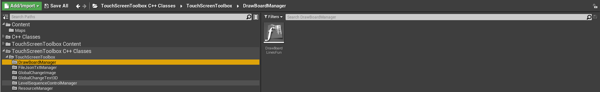

# Unreal 触控屏工具箱操作文档

## 目录

[TOC]

## 插件编译环境

+ Windows 10

+ Unreal 4.26.2
+ Visual Studio 2019

## 模块总览

+ 插件界面

  

+ 插件Content

  

  

  

  

  

  

  

  

+ 插件C++

  

  

  

  

  

  

  

## 功能模块

### TouchScreenGameMode

+ Content

  

+ 功能描述

  + 触控屏游戏模式
  + 支持鼠标点击
  + 关闭视角移动
  + 关闭飞行位移

+ 样例

  + 切换到WorldSetting

    

  + 选择游戏模式为BPTouchScreenGameMode  子模式选择对应的BPTouchScreenClass

    

    

### GlobalChangeText3D

+ Content

  

  

  

+ 功能描述

  + 全局修改自定义3D Text 组件
  + 注册 ID标识 ，通过注册ID整体修改
  + 支持关卡蓝图、子蓝图调用

+ 样例

  + 场景中拖入BPGlobalChangeText3DActor,设置注册ID（Global Change Text ID）  

    

    

  + 调用蓝图函数  SetGlobalChangeText3D    

    

    

    

  + GlobalChangeTextArray  为FString数组  数组中FString格式为  ID|Msg     ID为 注册ID（Global Change Text ID）  |为分割符   Msg为显示文本

    

  + 运行结果

    

### GlobalChangeImage

+ Content

  

  

  

  

+ 功能描述
  + 全局修改自定义动态Material组件
  + 注册 ID标识 ，通过注册ID整体修改
  + 支持关卡蓝图、子蓝图调用

+ 样例
  + 场景中拖入BPGlobalChangeImageActor,设置注册ID（Global Change Image ID）  

    

    

  + 调用蓝图函数  SetGlobalChangeImage  

    

    

  + GlobalChangeImageDataArray  为FString数组  数组中FString格式为  ID|ImageName   

  + ID为 注册ID（Global Change Image ID）  |为分割符   ImageName为图片名称（含后缀）

  + GlobalChangeImagePath  为图片路径

    

    

    

    

  + 运行结果

    

  

+ 自定义材质更换

  + 新建材质，创建 Texture Sample  选择默认Texture

    

  + 将节点转换成param

    

  + 参数名称改成T_GlobalChangeImage

    

  + 最终将自定义的材质拖拽到BPGlobalChangeImageActor的材质球上

    

  + ==注： 自定义材质在含有Texture Sample的param节点，参数名为T_GlobalChangeImage  且该材质为材质列表的第一个材质时生效==

+ FileJsonTxtManager                                JsonTxt文件管理模块

+ VideoControlManager                            视频控制管理模块

+ LevelSequenceControlManager           关卡序列动画管理模块

+ DrawBoardManager                               画板管理模块

  

+ ResourceManager                                   本地化存储管理模块

