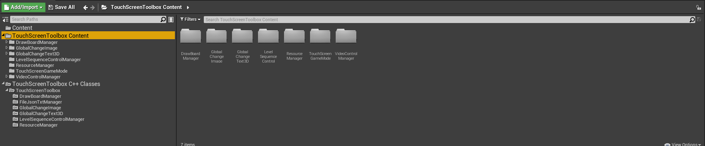
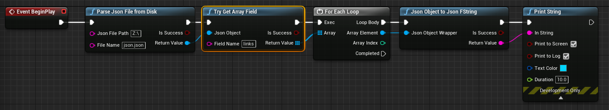
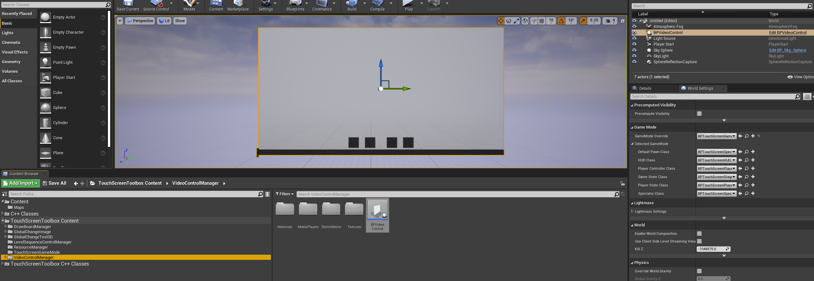
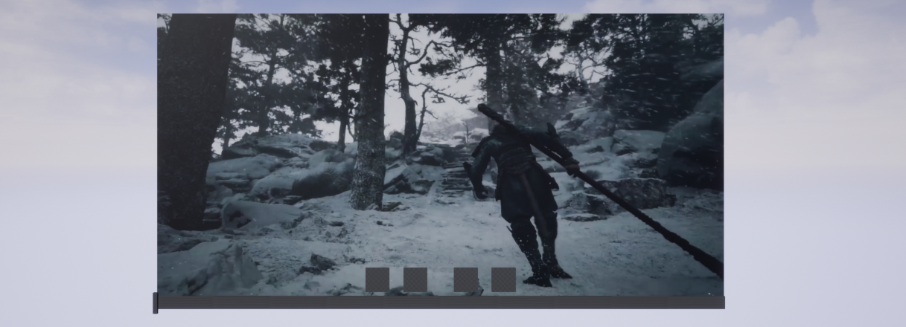
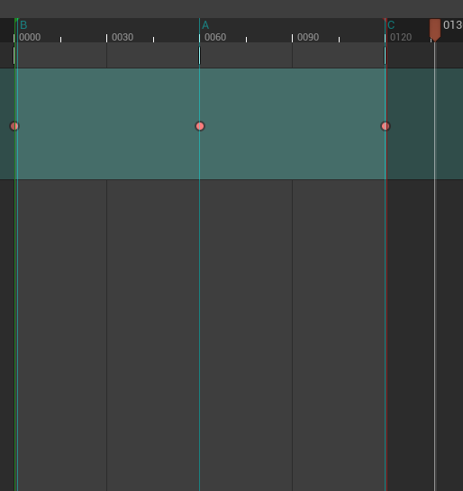
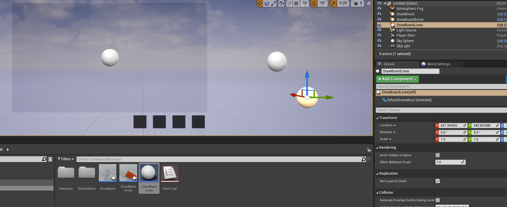
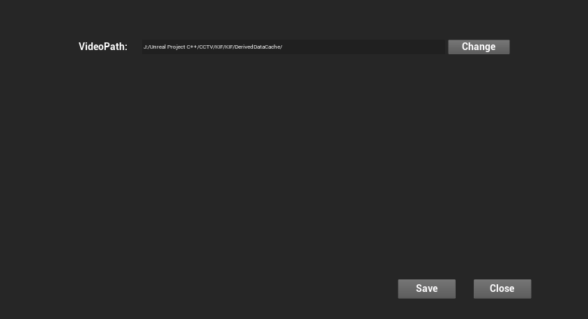

# Unreal 触控屏工具箱操作文档

## 目录

[TOC]

## 插件编译环境

+ Windows 10

+ Unreal 4.26.2
+ Visual Studio 2019

## 插件使用

+ 将插件压缩包解压

  

  

  

+ 将TouchScreenToolbox放到使用项目的插件文件夹中  如果没有，新建文件夹

  

  

  

+ 打开插件， 选择Project -> KIF  开启插件  重启Unreal

  

  

+ 打开Content

  

## 模块总览

+ 插件界面

  

  

+ 插件Content

  

  

  

  

  

  

  

  

  

+ 插件C++

  

  

  

  

  

  

  

## 功能模块

### TouchScreenGameMode

+ Content

  

  

+ 功能描述

  + 触控屏游戏模式
  + 支持鼠标点击
  + 关闭视角移动
  + 关闭飞行位移
  + 

+ 样例

  + 切换到WorldSetting

    

    

  + 选择游戏模式为BPTouchScreenGameMode  子模式选择对应的BPTouchScreenClass

    
  
    

### GlobalChangeText3D

+ Content

  

  

  

  

+ 功能描述

  + 全局修改自定义3D Text 组件
  + 注册 ID标识 ，通过注册ID整体修改
  + 支持关卡蓝图、子蓝图调用
  + 

+ 样例

  + 场景中拖入BPGlobalChangeText3DActor,设置注册ID（Global Change Text ID）  

    

    

    

  + 调用蓝图函数  SetGlobalChangeText3D    

    

    

    

  + GlobalChangeTextArray  为FString数组  数组中FString格式为  ID|Msg     ID为 注册ID（Global Change Text ID）  |为分割符   Msg为显示文本

    

    
  
  + 运行结果
  
    

### GlobalChangeImage

+ Content

  

  

  

  

  

+ 功能描述
  + 全局修改自定义动态Material组件
  
  + 注册 ID标识 ，通过注册ID整体修改

  + 支持关卡蓝图、子蓝图调用
  
    
  
+ 样例
  + 场景中拖入BPGlobalChangeImageActor,设置注册ID（Global Change Image ID）  

    

    

    

  + 调用蓝图函数  SetGlobalChangeImage  

    

    

    

  + GlobalChangeImageDataArray  为FString数组  数组中FString格式为  ID|ImageName   

  + ID为 注册ID（Global Change Image ID）  |为分割符   ImageName为图片名称（含后缀）

  + GlobalChangeImagePath  为图片路径

    

    

    

    

    

  + 运行结果
  
    
  
  
  
+ 自定义材质更换

  + 新建材质，创建 Texture Sample  选择默认Texture

    

    

  + 将节点转换成param

    

    

  + 参数名称改成T_GlobalChangeImage

    

    
  
  + 最终将自定义的材质拖拽到BPGlobalChangeImageActor的材质球上
  
    
  
  + ==注： 自定义材质在含有Texture Sample的param节点，参数名为T_GlobalChangeImage  且该材质为材质列表的第一个材质时生效==
  
    

### FileJsonTxtManager

+ Content

  

  

+ 功能描述
  + 读取Json/Txt文件
  
  + 解析JsonObject
  
  + 解析JsonObjectArray
  
  + 解析JsonValue
  
    
  
+ 样例

  + TXT解析 ParseTxtFileFromDisk 

    + 输入txt路径  txt名字（带后缀）  返回FString数组    按照换行分割

      

      

      

    + 演示

      

      

    + 运行结果

      

      

  + Json解析 ParseJsonFileFromDisk

    + 输入Json路径  Json名字(带后缀)  返回 JsonObject

      

      

      

    + 演示

      

      

    + 运行结果

      

      

  + Json解析Value  TryGetValueField

    + 输入 JsonObject   字段名称   返回字段对应值

      

      

      

    + 演示

      

      

    + 运行结果

      

      

  + Json解析JsonObject  TryGetObjectField

    + 输入JsonObject  字段名称   返回 JsonObject

      

      

      

    + 演示

      

      

    + 运行结果

      

      

  + Json解析JsonArray  TryGetArrayField

    + 输入JsonObject  字段名称   返回 JsonArray

      

      

      

    + 演示

      

      

    + 运行结果

      
      
      

  + JsonObject 转 Json FString   JsonObjectToJsonFstring

    + 输入JsonObject     返回 Json FString

      

      

      

    + 演示

      

      

    + 运行结果

      
      
      

  + Json FString 转 JsonObject   JsonFStringToJsonObject

    + 输入Json FString  字段名称   返回 JsonObject

      

      

      

    + 演示

      

      
    
    + 运行结果
    
      
      
      

+ ==注：浮点类型算小数点最多存放8位，超出范围数据会与源数据不同==

### VideoControlManager

+ Content

  

  

  

  

  

  

+ 功能描述

  + 自定义视频播放组件

  + 支持读写本地及局域网文件

  + 视频控制器组件

  + 支持视频播放、暂停、进度条、跳帧

  + 支持多窗口同视频流及不同视频流

  + 解决二维鼠标相对坐标问题，转为三维空间射线碰撞运算

    

+ 样例

  + 游戏模式更改成触控屏模式

    

    

  + 将BPVideoControl拖拽到场景

    

    

  + 将场景树中将BPVideoControl拖拽到关卡蓝图中初始化  InitVideoControl   输入为视频路径  视频列表的文件名（带后缀）   视频初始化的下标

    

    

    

    

  + 演示

    

    

  + 运行效果

    

    

    

    

    

+ 新增新的MediaPlayer

  + 复制VideoControlMediaPlayer    VideoControlVideoTexture    M_VideoControlMaterial  

    

    

    

    

  + Texture 中更改MediaPlayer

    

    

  + Meterial 中设置 Texture

    

    

  + 选择场景中的BPVideoControl  点击组件根级 设置 MediaPlayer  

    

    

  + 选择场景中的BPVideoControl  点击组件中VideoStaticMesh   设置 Material

    

    

  + 选择场景中的BPVideoControl  点击组件中MediaSound   设置 Media Player

    

+ ==注：触控采用3D射线碰撞实现，所以触控区域前方不能有其他物体遮挡==

### LevelSequenceControlManager

+ Content

  

  

+ 功能描述

  + 支持关卡序列异步播放、暂停、倒放、延时
  + 支持批量控制 共七种控制类型
    + 初始化
    + 正向播放
    + 倒放
    + 播放到固定时间
    + 跳转到固定时间
    + 播放到某个标记帧
    + 跳转到某个标记帧

+ 样例

  + 关卡序列设置  将所有动画设置 When Finished  设置成 Keep State

    

    

  + 插入标记   右键选择Add Mark

    

    

    

  + 将BPLevelSequenceControlActor拖拽到场景中，设置控制的关卡序列  设置 LevelSequence Control ID

    

    

  + 关卡序列控制  ControlGlobalLevelSequence

    

    

    + 输入  GlobalControlLevelSwquence Data Array   控制 LevelSequence Control ID  列表

      

      

    + 输入  Control Type  控制的类型 

      

      + Init   归零
      + Play  正向播放
      + Play Reverse  倒放
      + Play to by Time   播放到某个时间
      + Play to by Marded Frame Index  播放到标记帧  通过下标
      + Jump to by Time   跳转到某个时间
      + Jump to by Marded Frame Index 跳转到标记帧  通过下标

    + 输入  Control Time

      + 在 Play to by Time、Jump to by Time中生效

    + 输入  Control Marded Frame Index 

      + 在Play to by Marded Frame Index、Jump to by Marded Frame Index中生效

        

  + 演示

    

    

  + 运行效果

    

    

    

    

+ ==注：关卡序列运行时需把所有关卡序列的窗口关闭，否则会占有控制状态==

  

### DrawBoardManager

+ Content

  

  

  

  

+ 功能描述

  + 画板模块

  + 支持在指定区域 使用画笔或箭头

  + 支持撤销及清空功能

  + 画板空间计算采用三维坐标计算

    

+ 样例

  + 游戏模式更改成触控屏模式

    

    

  + 将DrawBoard拖拽到场景中

    

    

  + 将DrawBoardArrow拖拽到场景中

    

    

  + 将DrawBoardLines拖拽到场景中

    

    

  + DrawBoard中选择 DrawBoardArrow  DrawBoardLines

    

    

  + 运行效果

    

    

+ ==注：触控采用3D射线碰撞实现，所以触控区域前方不能有其他物体遮挡==

  

### ResourceManager

+ Content

  

  

+ 功能描述

  + 本地化存储管理模块
  + 将自定义变量以SaveGame格式本地化存储， 保存后下次开启可得到最终保存数据
  + 支持文件选取及文件夹选取

+ 样例

  + 选取文件夹  GetDialogDirectory

    

    

    

    + 演示

      

    

    + 运行结果

      

      

    

  + 选取文件 GetDialogFile

    

    

    

    + 演示

      

      

    + 运行结果

      

      

      

  + 拖拽BP_ResourceManager到场景中

    

    

    + 按Tab键显示全局资源

      

      

    + 点击Save保存  点击Close关闭

      

      

+ 添加新的本地化数据

  

  + 打开BP_SaveGameData  新添加数据变量

    

    

  + 打开BP_ResourceManagerWidget  中事件

    

    + 在 Event Construct 中初始化

      

      

    + 保存   设置SaveGame中数据  然后保存数据

      

    
