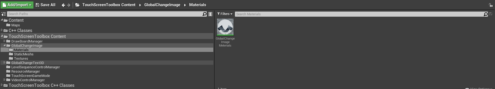
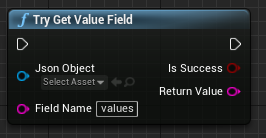

# Unreal 触控屏工具箱操作文档

## 目录

[TOC]

## 插件编译环境

+ Windows 10

+ Unreal 4.26.2
+ Visual Studio 2019

## 模块总览

+ 插件界面

  

+ 插件Content

  

  

  

  

  

  

  

  

+ 插件C++

  

  

  

  

  

  

  

## 功能模块

### TouchScreenGameMode

+ Content

  

+ 功能描述

  + 触控屏游戏模式
  + 支持鼠标点击
  + 关闭视角移动
  + 关闭飞行位移

+ 样例

  + 切换到WorldSetting

    

  + 选择游戏模式为BPTouchScreenGameMode  子模式选择对应的BPTouchScreenClass

    

    

### GlobalChangeText3D

+ Content

  

  

  

+ 功能描述

  + 全局修改自定义3D Text 组件
  + 注册 ID标识 ，通过注册ID整体修改
  + 支持关卡蓝图、子蓝图调用

+ 样例

  + 场景中拖入BPGlobalChangeText3DActor,设置注册ID（Global Change Text ID）  

    

    

  + 调用蓝图函数  SetGlobalChangeText3D    

    

    

    

  + GlobalChangeTextArray  为FString数组  数组中FString格式为  ID|Msg     ID为 注册ID（Global Change Text ID）  |为分割符   Msg为显示文本

    

  + 运行结果

    

### GlobalChangeImage

+ Content

  

  

  

  

+ 功能描述
  + 全局修改自定义动态Material组件
  + 注册 ID标识 ，通过注册ID整体修改
  + 支持关卡蓝图、子蓝图调用

+ 样例
  + 场景中拖入BPGlobalChangeImageActor,设置注册ID（Global Change Image ID）  

    

    

  + 调用蓝图函数  SetGlobalChangeImage  

    

    

  + GlobalChangeImageDataArray  为FString数组  数组中FString格式为  ID|ImageName   

  + ID为 注册ID（Global Change Image ID）  |为分割符   ImageName为图片名称（含后缀）

  + GlobalChangeImagePath  为图片路径

    

    

    

    

  + 运行结果

    

  

+ 自定义材质更换

  + 新建材质，创建 Texture Sample  选择默认Texture

    

  + 将节点转换成param

    

  + 参数名称改成T_GlobalChangeImage

    

  + 最终将自定义的材质拖拽到BPGlobalChangeImageActor的材质球上

    

  + ==注： 自定义材质在含有Texture Sample的param节点，参数名为T_GlobalChangeImage  且该材质为材质列表的第一个材质时生效==

### FileJsonTxtManager  

+ Content

  

+ 功能描述
  + 读取Json/Txt文件
  + 解析JsonObject
  + 解析JsonObjectArray
  + 解析JsonValue

+ 样例

  + TXT解析 ParseTxtFileFromDisk 

    + 输入txt路径  txt名字（带后缀）  返回FString数组    按照换行分割

      

      

    + 演示

      

    + 运行结果

      

      

  + Json解析 ParseJsonFileFromDisk

    + 输入Json路径  Json名字(带后缀)  返回 JsonObject

      

      

    + 演示

      

    + 运行结果

      

      

  + Json解析Value  TryGetValueField

    + 输入 JsonObject   字段名称   返回字段对应值

      

      

      

    + 演示

      

    + 运行结果

      

      

  + Json解析JsonObject  TryGetObjectField

    + 输入JsonObject  字段名称   返回 JsonObject

      

      

    + 演示

      

    + 运行结果

      

      

  + Json解析JsonArray  TryGetArrayField

    + 输入JsonObject  字段名称   返回 JsonArray

      

      

    + 演示

      

    + 运行结果

      

  + JsonObject 转 Json FString   JsonObjectToJsonFstring

    + 输入JsonObject     返回 Json FString

      

      

    + 演示

      

    + 运行结果

      

  + Json FString 转 JsonObject   JsonFStringToJsonObject

    + 输入Json FString  字段名称   返回 JsonObject

      

      

    + 演示

      

    + 运行结果

      

+ ==注：浮点类型算小数点最多存放8位，超出范围数据会与源数据不同==

### VideoControlManager

+ Content

  

+ 功能描述

  + 自定义视频播放组件
  + 支持读写本地及局域网文件
  + 视频控制器组件
  + 支持视频播放、暂停、进度条、跳帧
  + 支持多窗口同视频流及不同视频流
  + 解决二维鼠标相对坐标问题，转为三维空间射线碰撞运算

+ 样例

### LevelSequenceControlManager           

+ Content

  

+ 功能描述

  + 支持关卡序列异步播放、暂停、倒放、延时
  + 支持批量控制 共七种控制类型
    + 初始化
    + 正向播放
    + 倒放
    + 播放到固定时间
    + 跳转到固定时间
    + 播放到某个标记帧
    + 跳转到某个标记帧

+ 样例

### DrawBoardManager                               

+ Content

  

+ 功能描述

  + 画板模块
  + 支持在指定区域 使用画笔或箭头
  + 支持撤销及清空功能
  + 画板空间计算采用三维坐标计算

+ 样例

### ResourceManager                                   

+ Content

  

+ 功能描述

  + 本地化存储管理模块
  + 将自定义变量以SaveGame格式本地化存储， 保存后下次开启可得到最终保存数据
  + 支持文件选取及文件夹选取

+ 样例

